# Serino


Serino was originally designed to be a personal blog project focused on content, intuitive configuration, and exploring the integration of AI Agents and automation.

> 🙏 **Acknowledgments**: This project was inspired by [waline](https://github.com/walinejs/waline), [Shiro](https://github.com/Innei/Shiro), [astro-theme-pure](https://github.com/cworld1/astro-theme-pure), and [Yohaku](https://github.com/Innei/Yohaku). I am deeply fascinated by their meticulous designs, and I sincerely thank and salute the open-source spirit of the authors behind these projects.

## ✨ Example Site

- **[Aerisun](https://aerisun.top/)**

| | |
| --- | --- |
| 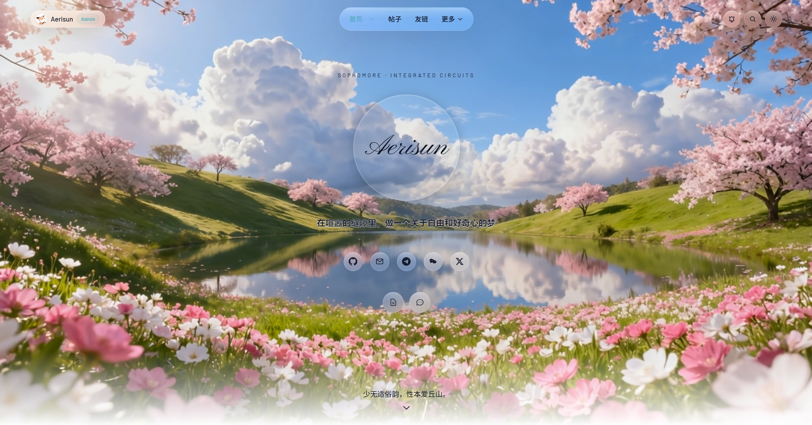 | 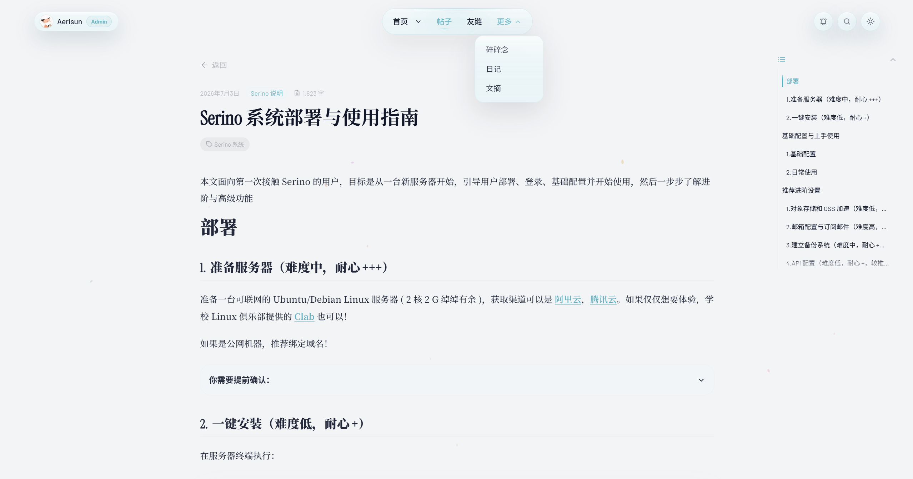 |
| 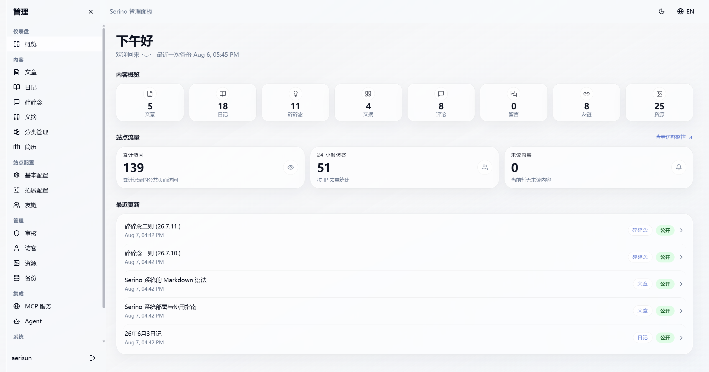 | 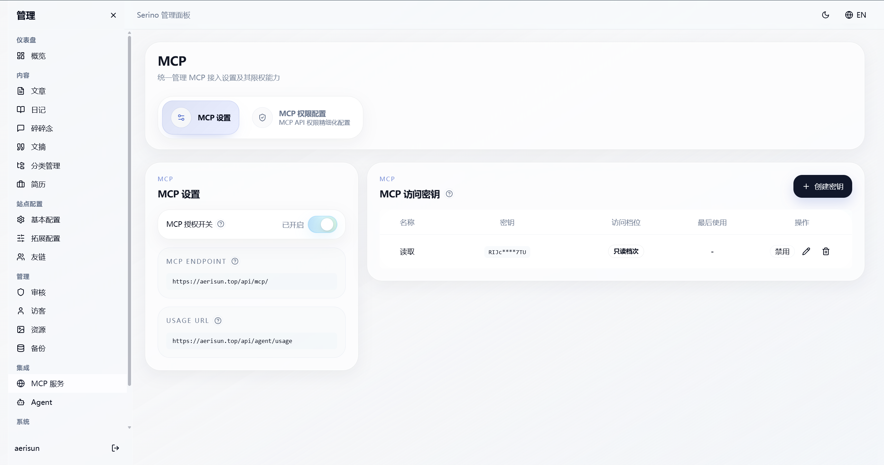 |

<details>
<summary>Expand to view more showcases</summary>

| | |
| --- | --- |
| 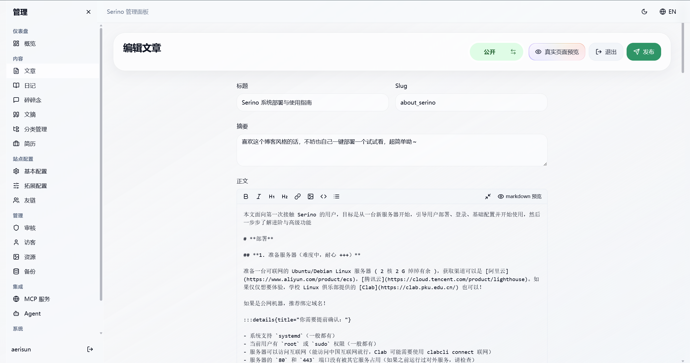 | 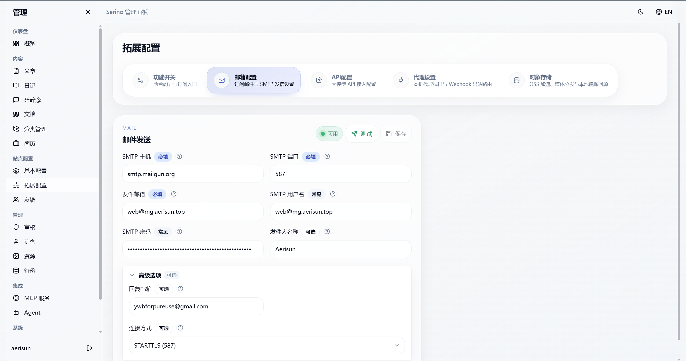 |
| 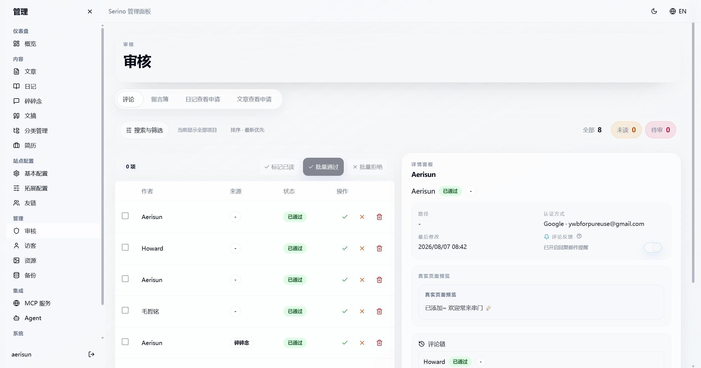 | 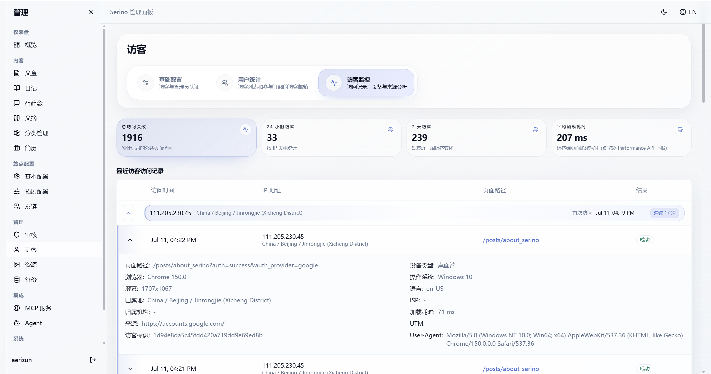 |
| 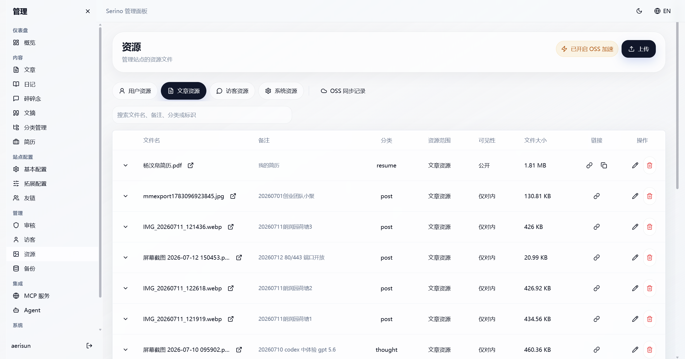 | 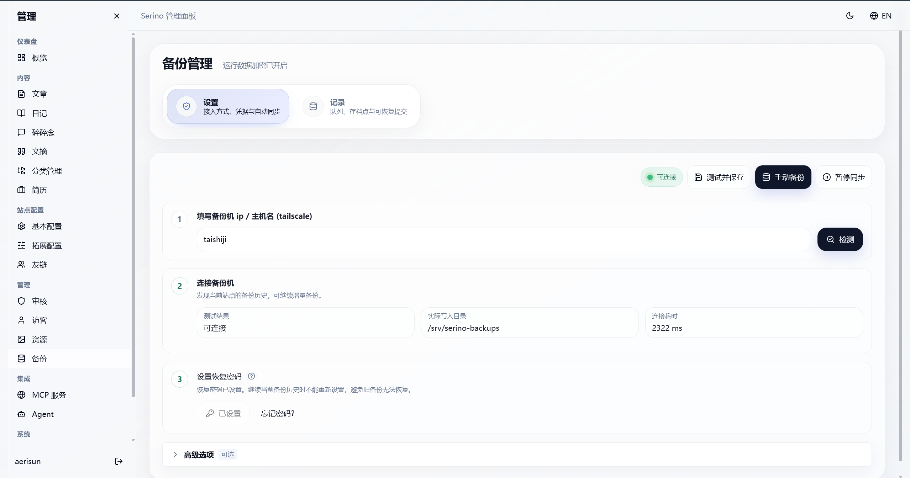 |
| 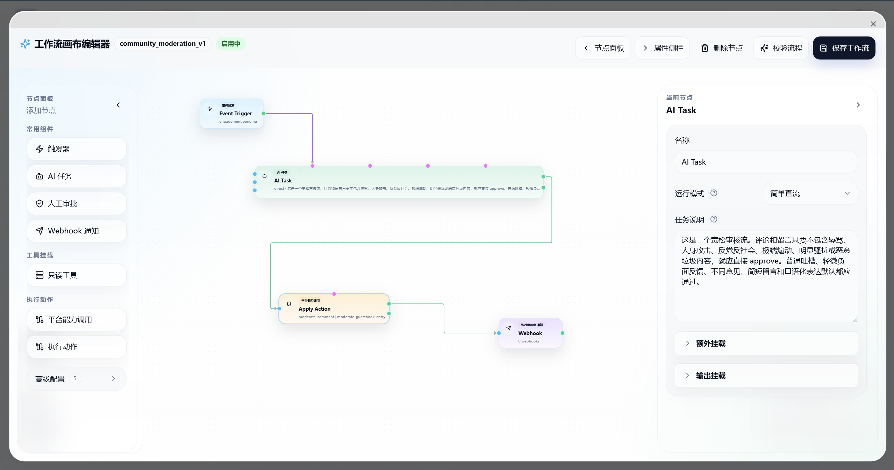 | 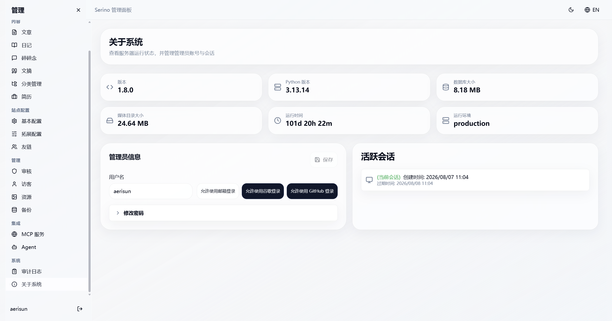 |
| 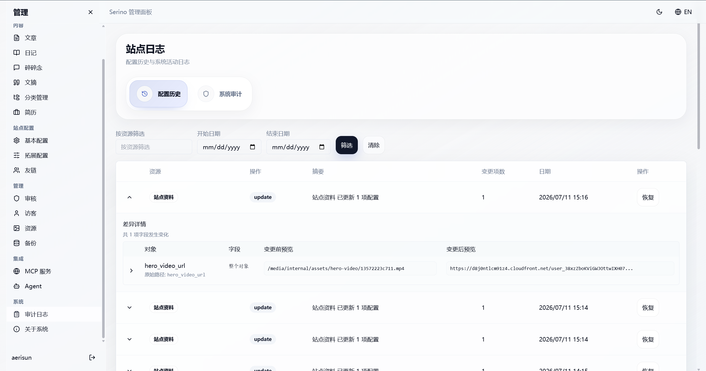 | 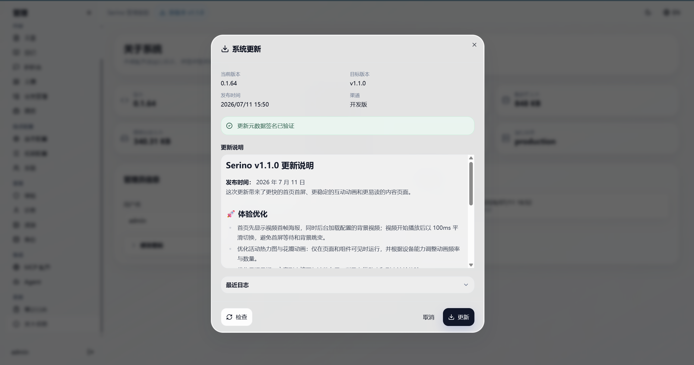 |

</details>

---

## 📦 One-Click Installation

You only need an internet-connected `Ubuntu/Debian` Linux server (works with domestic Chinese internet as well). Simply run the following command in your terminal:

```bash
curl -fsSL https://install.aerisun.top/serino/install.sh | bash
```
[**Click here to view the Detailed Deployment & Usage Guide**](https://aerisun.top/posts/serino-tutorial)

<details>
<summary>What the installer does:</summary>

- If legacy leftovers or an existing installation are detected, it will prompt for confirmation, then clean up the old layout and remnants before proceeding.
- Automatically parses the current stable channel version, downloads the corresponding installation package, extracts it, and executes it.
- First checks for Linux / systemd / root or sudo privileges / CPU architecture, and verifies if ports 80 and 443 are available. If installing with a domain, it also performs a DNS pre-check.
- If Docker is not installed on the system, it automatically installs and enables Docker, then checks the availability of `docker compose`.
- Writes a standard deployment layout: program and scripts go to `/opt/serino`, production config to `/etc/serino/serino.env`, runtime data to `/var/lib/serino`, and installs `sercli` and systemd units.
- Generates and hardens production environment configuration, including site URL, CORS, Waline URL, secure domains, image registry, `WALINE_JWT_TOKEN`, and the initial admin account and password.
- Pulls the API, frontend, and Waline images according to the generated configuration.
- Executes database migrations, applies the production baseline, runs blocking data migrations, and initializes the first admin user.
- Starts Caddy alongside the stack, automatically handling inbound traffic on ports 80/443 and processing HTTPS/TLS certificate issuance.
- Starts the site and waits for the frontend, backend, Waline, and corresponding HTTPS endpoints to be ready, then schedules background data migrations.

</details>

---

## 🚀 Core Features

- 🛡️ **Absolute Decoupling**: `Pure code` and `data configuration` are completely separated!
- 🚀 **Hassle-Free Deployment**: Deploy with a single command! Installation, restart, upgrade, and uninstallation are all one-click operations, eliminating unnecessary hassle!
- ⚙️ **Intuitive Configuration**: Say goodbye to modifying source code. All site parameters are adjusted in real-time through a layered backend UI, making it clear and easy to expand.
- 🎨 **Minimalist Aesthetics**: Elegant whitespace paired with subtle interactions delivers a distraction-free, immersive reading experience that adapts to all devices.
- 📝 **Extended Syntax**: Equipped with a powerful Markdown extension parsing engine, easily handling diverse and personalized layouts.
- 🔌 **Native MCP Support**: Built-in standard MCP API with over a hundred capabilities, securely integrating with openclaw through strict permission domains.
- ☁️ **OSS Dual-Active Backup**: Resource uploads and downloads are accelerated via OSS, with asynchronous local synchronization for a secure, cost-free acceleration experience.
- 📧 **Native Subscription Delivery**: The system comes with a built-in SMTP engine, elegantly delivering new articles directly to subscribers' emails in real-time.
- 🤝 **Social & RSS**: Lightweight RSS fetching builds your blogosphere, keeping you updated with the latest dynamics of friend sites instantly.
- 🤖 **Agent Butler**: Built-in LangGraph automation workflows, with various orchestrations waiting for you to explore.

---

## 🧭 Project Development Status

The core features of the project are already stable for production use, with a very few advanced capabilities still being refined. The system will automatically detect and notify you of updates, which can then be applied with one click from the admin dashboard.

**Tested & Passed**

- [x] One-click deployment flow via installer (tested on domestic networks) `Completed May 6`
- [x] All pages, features, and content display on the site frontend `Completed May 6`
- [x] Editing and management of core content (articles, thoughts, excerpts, diaries, categories) in the backend admin panel (optimized for mobile, buttery smooth) `Completed May 6`
- [x] Automated pipeline for development environment and production operations largely implemented `Completed May 6`
- [x] Advanced backend capabilities: site config management, friend link management, comment management, visitor management, OSS acceleration, static asset management, subscription emails, audit log tracking, etc. `Completed July 2`
- [x] Upgrade of the visitor tracking system `Completed July 1`
- [x] Optimization of information density and practicality on the backend admin dashboard overview page `Completed July 1`
- [x] MCP service tested and verified as production-ready `Completed July 2`
- [x] Backup service simplified and improved, testing passed `Completed July 3`
- [x] SEO/GEO optimization `Completed July 4`
- [x] Implemented automatic update detection for production, update notifications, and one-click system updates via the admin panel `Completed July 5`

**In Progress / To Do**

- [ ] Add daily diagnostic and failure alert features for integrated advanced configurations (API, OSS, SMTP, proxies, backup connections, MCP service validity)
- [ ] Add a visually appealing gallery page
- [ ] Explore embedding website content and combining it with RAG to achieve a digital-human-like Q&A experience
- Let your imagination run wild...

**Striving for Perfection**

- [ ] Further expand and refine the MCP service with modern encapsulation
- [ ] Generalization and orchestration experience of the Agent system
- [ ] More exquisite UI, smoother and more human-centric interactions, more effective caching and performance optimizations, and deeper security constraints with permission isolation strategies

---

## 📖 System Design & Documentation

- [Project Architecture (Architecture)](docs/architecture.md)
- [Production Operations Plan (Operations)](docs/operations.md)
- Pre-release operational smoke gate: `bash scripts/release-smoke-gate.sh`

---

## Manual Deployment & Development

### 🐳 Docker Compose Manual Deployment

If you prefer manual control over the deployment structure, this path is now considered advanced usage.  
Note: Production containers do not automatically execute baselines and data migrations upon startup, so you can no longer rely solely on `docker compose up -d`.

```bash
mkdir aerisun && cd aerisun
wget https://raw.githubusercontent.com/Aerisun/Serino/main/docker-compose.release.yml
wget https://raw.githubusercontent.com/Aerisun/Serino/main/.env.production.local.example -O .env.production.local

vim .env.production.local # Must fill in initial admin account, password, and other necessary configurations
docker compose --env-file .env.production.local -f docker-compose.release.yml pull
docker compose --env-file .env.production.local -f docker-compose.release.yml run --rm --no-deps api /bin/bash /app/backend/scripts/migrate.sh
docker compose --env-file .env.production.local -f docker-compose.release.yml run --rm --no-deps api /bin/bash /app/backend/scripts/baseline-prod.sh
docker compose --env-file .env.production.local -f docker-compose.release.yml run --rm --no-deps api /bin/bash /app/backend/scripts/data-migrate.sh apply --mode blocking
docker compose --env-file .env.production.local -f docker-compose.release.yml run --rm --no-deps api /bin/bash /app/backend/scripts/first-admin-prod.sh
docker compose --env-file .env.production.local -f docker-compose.release.yml up -d
docker compose --env-file .env.production.local -f docker-compose.release.yml run --rm --no-deps api /bin/bash /app/backend/scripts/data-migrate.sh schedule --mode background

```

---

## 💻 Local Development Guide

Requirements: `Node.js 22.x+`, `pnpm`, `uv`.

```bash
# 1. Clone the repository
git clone https://github.com/Aerisun/Serino

# 2. Install frontend and backend dependencies
pnpm install --frozen-lockfile
cd backend && uv sync --dev

# 3. Start development environment (supports multiple worktrees)
make dev        # Method 1: Seed with development dummy data (Dev Seed)
make dev-ts     # Same as make dev, but enables Tailscale Serve forwarding for easy mobile/remote device access
make dev-pseed  # Method 2: Seed with production initialization data, for tuning production seeds (Prod Seed)
# Locked out of the backend due to password issues? Try cd backend & uv run aerisun-create-admin

make dev-stop   # Stop the entire local development environment and release Tailscale forwarding started by dev-ts

# 4. Production deployment test
curl -fsSL https://install.aerisun.top/serino/dev/vX.Y.Z/install.sh | bash # Test installation (identical to the official installer except it uses the latest dev channel and image sources)
# Only one channel should be selected per machine at a time. To switch, run `sercli uninstall --force` first, then reinstall. Using version numbers avoids errors due to CDN caching.
# If installation fails due to unstable network, you can adjust max-concurrent-downloads
```

- Default frontend URL: `http://127.0.0.1:8080/`
- Default backend URL: `http://127.0.0.1:3001/admin/`
- Default local dev admin credentials: `admin / admin123`
