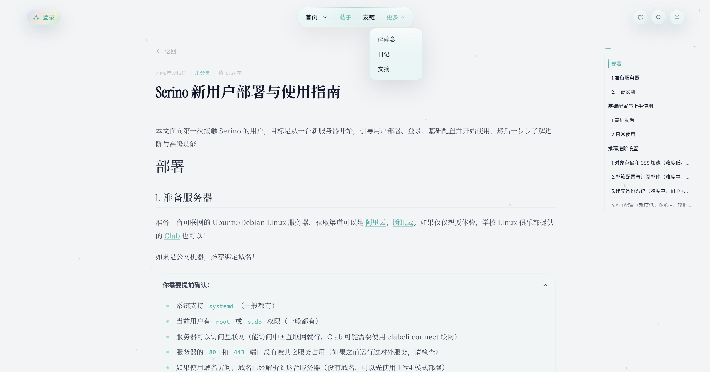
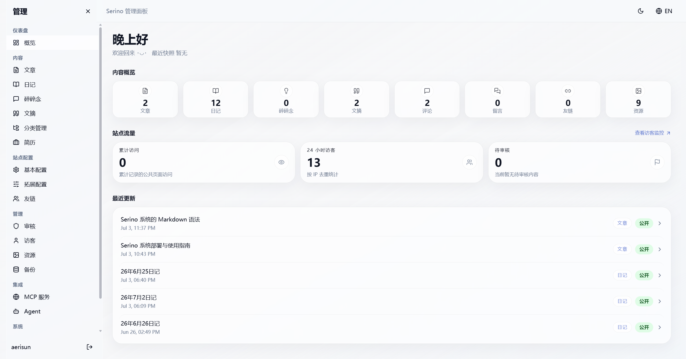
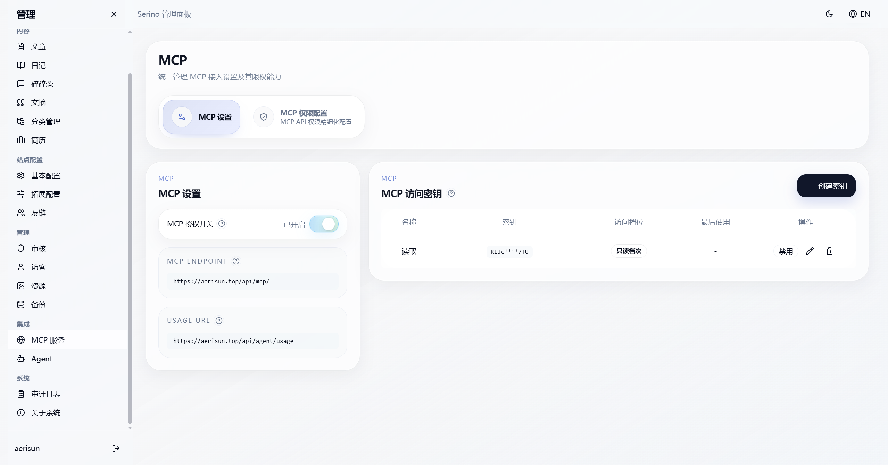

# Serino


Serino 设计初衷是打造一个专注内容、方便配置、探索融入 Agent 与自动化的个人博客项目。

> 🙏 **致谢**：本项目参考了 [waline](https://github.com/walinejs/waline)、[Shiro](https://github.com/Innei/Shiro) 、[astro-theme-pure](https://github.com/cworld1/astro-theme-pure)、 [Yohaku](https://github.com/Innei/Yohaku) ，我深深地沉醉于他们的匠心设计，在此由衷感谢和致敬这些项目作者的开源精神。

## ✨ 示例站点

- **[Aerisun](https://aerisun.top/)**

| | |
| --- | --- |
|  |  |
|  |  |

---

## 📦 一键安装

你只需要一台可联网（我国互联网即可）的 `Ubuntu/Debian` Linux 服务器，终端键入以下命令即可：

```bash
curl -fsSL https://install.aerisun.top/serino/install.sh | bash
```
[**点击查看《详细的部署与使用指南》**](https://aerisun.top/posts/15)

<details>
<summary>安装器会干什么：</summary>

- 如果检测到旧版残留或现有安装，会先提示确认，随后清理旧布局与残留再继续。
- 自动解析当前 stable 渠道版本，下载对应安装包并解压执行。
- 先检查 Linux / systemd / root 或 sudo / CPU 架构，以及 80、443 端口是否空闲；如果使用域名安装，还会先做 DNS 预检。
- 如果系统还没有 Docker，会自动安装并启用 Docker，随后检查 `docker compose` 可用性
- 写入标准部署布局：程序与脚本放到 `/opt/serino`，生产配置放到 `/etc/serino/serino.env`，运行数据放到 `/var/lib/serino`，并安装 `sercli` 和 systemd 单元。
- 生成并固化生产环境配置，包括站点地址、CORS、Waline 地址、安全域名、镜像仓库、`WALINE_JWT_TOKEN` 以及首次管理员账号和密码。
- 按生成后的配置先拉取 API、前台和 Waline 镜像
- 执行数据库迁移、应用 production baseline、执行阻塞式数据迁移，并初始化首次管理员
- 随编排一起启动 Caddy，自动接管放行 80/443 入口并处理 HTTPS/TLS 证书签发
- 启动站点并等待前台、后台、Waline 以及相应的 HTTPS 就绪，然后调度后台数据迁移

</details>

---

## 🚀 核心特性

- 🛡️ **绝对解耦**：`纯代码`与`数据配置`彻底分离！
- 🚀 **方便省心**：一句命令行部署！安装、重启、升级、卸载一键完成，杜绝折腾！
- ⚙️ **舒适配置**：告别修改源码，全站参数均通过分层设计的后台 UI 实时调整，清晰易拓。
- 🎨 **极简美学**：素雅留白搭配内敛交互，带来全端自适应的无干扰沉浸阅读。
- 📝 **扩展语法**：搭载强大的 Markdown 扩展解析引擎，轻松驾驭个性的多样化排版。
- 🤖 **Agent 管家**：内置 LangGraph 自动化工作流，各种编排等你探索
- 🔌 **MCP 原生支持**：内建标准 MCP API，百余能力，借助严密权限域安全对接 openclaw。
- ☁️ **OSS 双活备份**：资源上传下载都经由 OSS 加速，异步本地同步，安全无成本的加速体验。
- 📧 **原生订阅投递**：系统自带 SMTP 引擎，第一时间将新文精美推达读者订阅邮箱。
- 🤝 **社交与 RSS**：轻量的 RSS 抓取构建朋友圈，第一时间了解友站的最新动态

---

## 🧭 项目开发状态

项目主体功能已经可以在生产环境下运行，部分高阶能力仍在持续完善，后续的开发都可以通过 `sercli upgrade` 命令无缝升级到最新版本。

**已测试通过**

- [x] 安装器一键部署流程（国内网络已测试）
- [x] 站点前端展示侧的全部页面、功能和内容展示
- [x] 后端管理台中，文章、随想、摘录、日记、分类这些主体内容的编辑与管理（移动端做过优化，纵享丝滑）
- [x] 基本实现了开发环境和生产运维的自动化链路流程
- [x] 站点各类配置管理、友链管理、评论管理、访客管理、OSS 加速、静态资源管理、订阅邮箱、审计日志追踪等后台高级能力
- [x] 访客追踪系统的 debug
- [x] 优化后端管理台的概览页面信息密度与实用性
- [x] MCP 服务测试通过，真实可用
- [x] 备份服务做了简化和完善，测试通过
- [x] SEO/GEO 优化

**有待努力**

- [ ] 添加日常自动诊断的功能
- [ ] 对 MCP 服务进行进一步拓展和完善，进行现代化封装
- [ ] Agent 系统的通用性和编排体验
- [ ] 实现生产环境自动发现更新，提醒更新，自动更新
- [ ] 管理台中，站点配置管理、集成系统等高级功能的移动端适配效果
- [ ] 更完整的 `sercli` 运维命令集
- [ ] 更深入的安全约束与权限隔离策略

---

## 📖 系统设计与文档

- [项目架构 (Architecture)](docs/architecture.md)
- [生产运维方案 (Operations)](docs/operations.md)
- 发布前运维 smoke gate：`bash scripts/release-smoke-gate.sh`

---

## 手动部署与开发

### 🐳 Docker Compose 手动部署

如果你偏好手控部署结构，这条路径现在属于高级用法。  
注意：生产容器启动不会自动执行 baseline 和数据迁移，所以不能再只靠 `docker compose up -d`。

```bash
mkdir aerisun && cd aerisun
wget https://raw.githubusercontent.com/Aerisun/Serino/main/docker-compose.release.yml
wget https://raw.githubusercontent.com/Aerisun/Serino/main/.env.production.local.example -O .env.production.local

vim .env.production.local # 必须填写初始化管理员账号、密码等必要配置
docker compose --env-file .env.production.local -f docker-compose.release.yml pull
docker compose --env-file .env.production.local -f docker-compose.release.yml run --rm --no-deps api /bin/bash /app/backend/scripts/migrate.sh
docker compose --env-file .env.production.local -f docker-compose.release.yml run --rm --no-deps api /bin/bash /app/backend/scripts/baseline-prod.sh
docker compose --env-file .env.production.local -f docker-compose.release.yml run --rm --no-deps api /bin/bash /app/backend/scripts/data-migrate.sh apply --mode blocking
docker compose --env-file .env.production.local -f docker-compose.release.yml run --rm --no-deps api /bin/bash /app/backend/scripts/first-admin-prod.sh
docker compose --env-file .env.production.local -f docker-compose.release.yml up -d
docker compose --env-file .env.production.local -f docker-compose.release.yml run --rm --no-deps api /bin/bash /app/backend/scripts/data-migrate.sh schedule --mode background

```

---

## 💻 本地开发指南

环境要求：`Node.js 22.x+`、`pnpm`、`uv`。

```bash
# 1.拉取代码
git clone https://github.com/Aerisun/Serino

# 2. 安装前端与后端依赖
pnpm install --frozen-lockfile
cd backend && uv sync --dev

# 3. 启动开发环境（支持多工作树）
make dev        # 启动方式 1：灌入开发用假数据 (Dev Seed)
make dev-ts     # 同 make dev 但是开启 Tailscale Serve 转发，方便手机/远程设备访问
make dev-pseed  # 启动方式 2：灌入生产初始化数据，用于调整生产种子 (Prod Seed)
# 密码改废进不了后台? 试试 cd backend & uv run aerisun-create-admin

make dev-stop   # 停止整套本地开发环境，并释放 dev-ts 开启的 Tailscale 转发

# 4. 生产环境部署测试
curl -fsSL https://install.aerisun.top/serino/dev/vX.Y.Z/install.sh | bash # 测试安装（除了使用最新的 dev 渠道和镜像来源，别的与正式安装器完全一致）
# 单台机器一次只应选择一个渠道，切换先行 `sercli uninstall --force` 再重装；因为 CDN 缓存的关系，所以使用版本号避免错误
# 网络不稳定失败可以调节 max-concurrent-downloads
```

- 默认前台地址：`http://127.0.0.1:8080/`
- 默认后台地址：`http://127.0.0.1:3001/admin/`
- 开发本地默认管理员账密：`admin / admin123`
