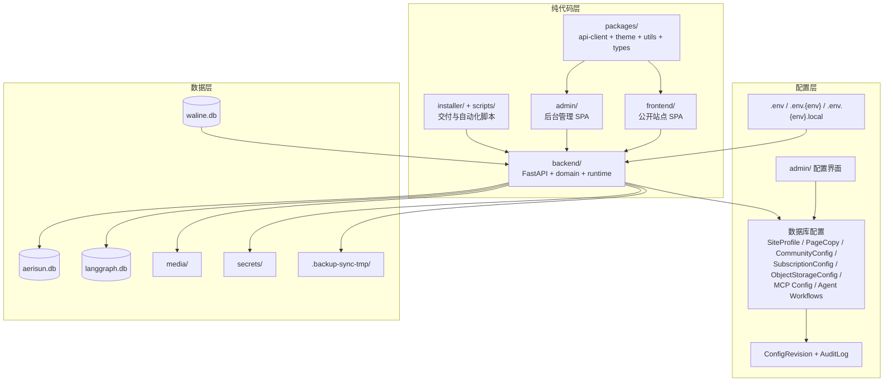
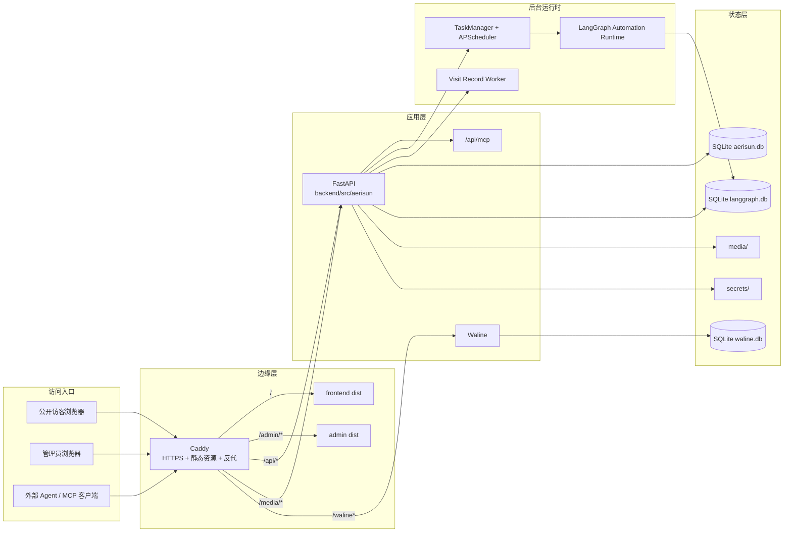
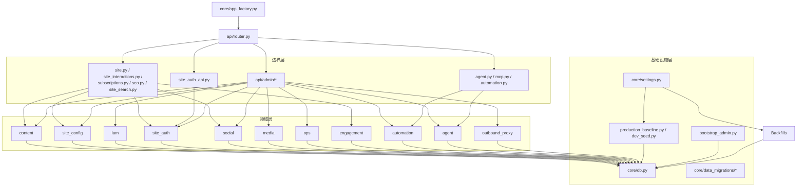
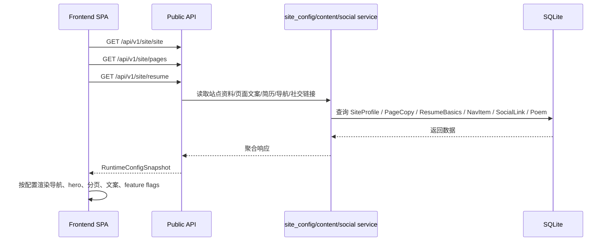
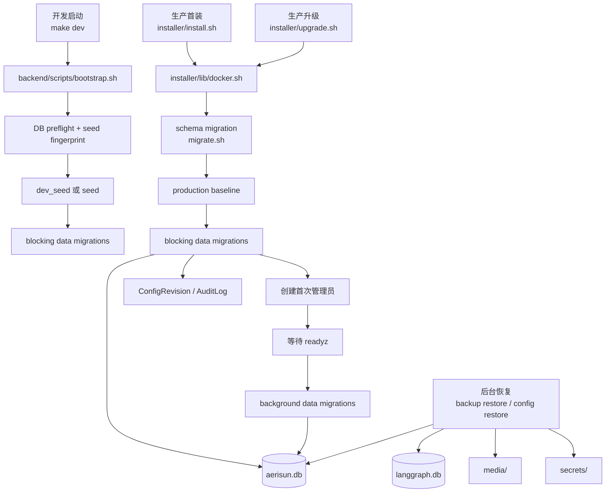
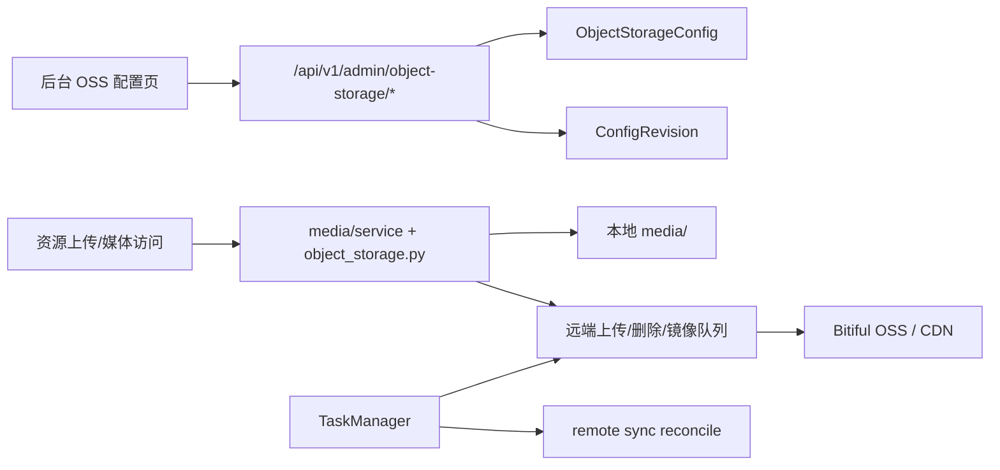
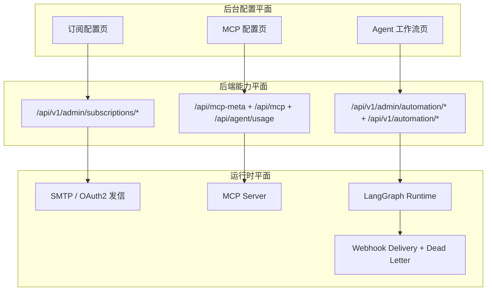
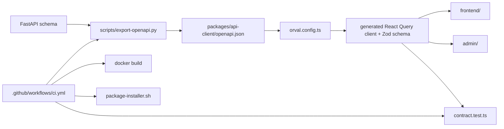

# 项目架构

## 架构主线

这套架构最核心的主线只有几条：

- 纯代码、数据、配置分层，不把配置写死在代码里
- 后台做统一控制面，尽量不用改代码来改站点和系统行为
- 升级、备份、恢复、契约同步尽量自动化，少靠人工手写
- MCP、Agent、OSS、订阅、Webhook、友链/RSS 这些能力都进入主系统

对应到仓库结构，就是把下面三层明确拆开并串起来：

- 纯代码层：`frontend/`、`admin/`、`backend/`、`packages/`、`installer/`、`scripts/`
- 数据层：`aerisun.db`、`waline.db`、`langgraph.db`、`media/`、`secrets/`
- 配置层：`.env.*`、数据库配置表、后台管理页、配置版本快照、安装器生成的 `.env.production.local`

---

## 代码 / 数据 / 配置分离图

### 相关文件

- 环境变量链：`backend/src/aerisun/core/settings.py`
- 后台配置 API：`backend/src/aerisun/api/admin/site_config.py`
- 订阅配置 API：`backend/src/aerisun/api/admin/subscriptions.py`
- OSS 配置 API：`backend/src/aerisun/api/admin/object_storage.py`
- MCP / Agent 配置 API：`backend/src/aerisun/api/admin/system.py`、`backend/src/aerisun/api/admin/automation.py`
- 配置版本与恢复：`backend/src/aerisun/domain/ops/config_revisions.py`

---

## 顶层组件图

### 运行时边界

- `frontend/` 与 `admin/` 只是静态站点，运行时不持有业务状态。
- `backend/` 是主控制面，同时服务公开 API、后台 API、MCP、自动化运行时、后台调度。
- `waline` 是独立评论服务，但通过 `Caddyfile` 被统一挂到 `/waline`。
- 工作流 checkpoint 不混进主业务库，单独放在 `langgraph.db`。

对应文件：

- 应用装配：`backend/src/aerisun/core/app_factory.py`
- 生命周期启动：`backend/src/aerisun/core/bootstrap.py`
- 反向代理：`Caddyfile`
- 生产编排：`docker-compose.release.yml`
- 后台任务：`backend/src/aerisun/core/task_manager.py`

---

## 后端分层图

### 后端结构的实际特点

- `api/` 负责协议边界、参数和鉴权。
- 真实逻辑主要在 `domain/*/service.py`、`repository.py`、`schemas.py`。
- `domain/` 不是按表名拆，而是按站点能力拆。
- 这让 HTTP API、MCP、自动化运行时、种子/回填能共享同一套领域逻辑。

---

## 主要领域模块

| 模块          | 主要职责                                                       | 核心文件                                  |
| ------------- | -------------------------------------------------------------- | ----------------------------------------- |
| `content`     | 文章/日记/碎碎念/文摘、搜索、SEO、导入导出、诗句生成           | `backend/src/aerisun/domain/content/`     |
| `site_config` | 站点资料、导航、页面文案、社区配置、简历、前台 feature flags   | `backend/src/aerisun/domain/site_config/` |
| `iam`         | 后台用户、后台 Session、API Key、scope、MCP 权限基础           | `backend/src/aerisun/domain/iam/`         |
| `site_auth`   | 站点用户、OAuth、站点 Session、管理员绑定                      | `backend/src/aerisun/domain/site_auth/`   |
| `social`      | 友链、RSS 动态、站点健康检查                                   | `backend/src/aerisun/domain/social/`      |
| `media`       | 资产上传、公开访问、对象存储配置、远端上传/删除/补偿队列       | `backend/src/aerisun/domain/media/`       |
| `ops`         | 审计日志、配置版本、访客记录、流量快照、备份同步与恢复         | `backend/src/aerisun/domain/ops/`         |
| `engagement`  | 留言、评论、反应、评论图片上传                                 | `backend/src/aerisun/domain/engagement/`  |
| `automation`  | 工作流定义、编译、运行、审批、Webhook、运行明细、Surface 草稿  | `backend/src/aerisun/domain/automation/`  |
| `agent`       | MCP capability 列表、usage 文档、MCP 配置裁剪与 companion 入口 | `backend/src/aerisun/domain/agent/`       |

---

## 后台是统一控制面，不是单纯 CMS

- 站点资料/导航/页面文案/社区配置：`admin/src/pages/site-config/`
- 邮箱订阅/功能开关/外部配置/代理/OSS：`admin/src/pages/more/`
- 访客/订阅者/留言审核：`admin/src/pages/visitors/`、`admin/src/pages/moderation/`
- 审计/配置版本/备份/系统信息：`admin/src/pages/system/`
- MCP 设置与权限：`admin/src/pages/integrations/`
- Agent 工作流、运行记录、审批、Webhook：`admin/src/pages/automation/`

---

## 前台配置驱动链路

对应代码：

- 配置加载入口：`frontend/src/contexts/RuntimeConfigContext.tsx`
- 前台配置归一化：`frontend/src/lib/runtime-config/index.ts`
- 公开配置 API：`backend/src/aerisun/api/site.py`

前台不把文案写在 TS 常量里，而是把后端当成运行时配置源。

---

## 升级、初始化、恢复链路

### 三条链路解释

| 场景 | 真实路径                                                                                 | 作用                                             |
| ---- | ---------------------------------------------------------------------------------------- | ------------------------------------------------ |
| 开发 | `Makefile` -> `scripts/dev-start.sh` -> `backend/scripts/bootstrap.sh` | 预检数据库、按 seed profile 灌开发或生产风格数据，并执行 blocking data migrations |
| 首装 | `installer/install.sh` -> `migrate.sh` / `baseline-prod.sh` / `data-migrate.sh` / `first-admin-prod.sh` | schema migration + production baseline + blocking data migrations + 首次管理员 |
| 升级 | `installer/upgrade.sh` -> `migrate.sh` / `data-migrate.sh` | schema migration + blocking/background data migrations，不重复覆盖已有业务数据 |

关键文件：

- `backend/scripts/bootstrap.sh`
- `backend/scripts/migrate.sh`
- `backend/scripts/baseline-prod.sh`
- `backend/scripts/data-migrate.sh`
- `backend/scripts/first-admin-prod.sh`
- `backend/src/aerisun/core/production_baseline.py`
- `backend/src/aerisun/core/dev_seed.py`
- `backend/src/aerisun/core/data_migrations/runner.py`
- `backend/src/aerisun/core/bootstrap_admin.py`

---

## 恢复与灾后能力

### 1. 配置级恢复

- 每次关键配置更新都会记录 `ConfigRevision` 和 `AuditLog`。
- 资源级恢复处理器已经注册到 `backend/src/aerisun/domain/ops/config_revisions.py`。
- 可恢复对象包括：
  - 站点资料
  - 社区配置
  - 导航
  - 社交链接
  - 诗句
  - 页面文案
  - 访客鉴权
  - 订阅配置
  - 出站代理
  - OSS 配置
  - MCP 公共访问
  - Agent 模型配置
  - Agent 工作流

### 2. 数据级恢复

- 备份同步与恢复在 `backend/src/aerisun/domain/ops/backup_sync.py`
- 恢复时会原子替换：
  - `aerisun.db`
  - `waline.db`
  - `langgraph.db`
  - `media/`
  - `secrets/`
  - automation packs
- 还有恢复密钥导出与确认机制，对应 `BackupRecoveryKey`

---

## OSS 加速位置图

真实行为：

- 配置存库并带版本快照：`backend/src/aerisun/api/admin/object_storage.py`
- 本地文件不消失，远端同步由后台任务补偿：`backend/src/aerisun/domain/media/object_storage.py`、`backend/src/aerisun/core/task_manager.py`

OSS 是“加速层和分发层”，不是把本地媒体彻底替换掉。

---

## 订阅、Webhook、MCP、Agent 的位置

### 这里的边界

- 邮箱订阅是主系统能力：`backend/src/aerisun/domain/subscription/service.py`
- Webhook 有配置、投递、重试、死信：`backend/src/aerisun/domain/automation/models.py`
- MCP 是 capability + scope + API key + usage 文档组合：`backend/src/aerisun/mcp_server.py`、`backend/src/aerisun/domain/agent/service.py`
- Agent/Automation 已经具备独立运行时、审批和工作流图：`backend/src/aerisun/domain/automation/runtime.py`、`admin/src/pages/automation/`

---

## 契约自动化与交付自动化

- 避免手写接口层和类型漂移
- 避免前后台各自猜 API
- 把契约偏差变成 CI 失败，而不是线上事故

---

## 关键文件索引

- 应用装配：`backend/src/aerisun/core/app_factory.py`
- 生命周期：`backend/src/aerisun/core/bootstrap.py`
- 调度中心：`backend/src/aerisun/core/task_manager.py`
- API 总路由：`backend/src/aerisun/api/router.py`
- 公开 API：`backend/src/aerisun/api/site.py`
- 后台总路由：`backend/src/aerisun/api/admin/__init__.py`
- MCP：`backend/src/aerisun/api/mcp.py`、`backend/src/aerisun/mcp_server.py`
- Agent usage：`backend/src/aerisun/api/agent.py`
- 自动化运行时：`backend/src/aerisun/domain/automation/runtime.py`
- 对象存储：`backend/src/aerisun/domain/media/object_storage.py`
- 订阅：`backend/src/aerisun/domain/subscription/service.py`
- 配置恢复：`backend/src/aerisun/domain/ops/config_revisions.py`
- 备份恢复：`backend/src/aerisun/domain/ops/backup_sync.py`
- 开发启动：`scripts/dev-start.sh`
- 启动引导：`backend/scripts/bootstrap.sh`
- 生产编排：`docker-compose.release.yml`
- 安装器：`installer/install.sh`
- 升级器：`installer/upgrade.sh`
